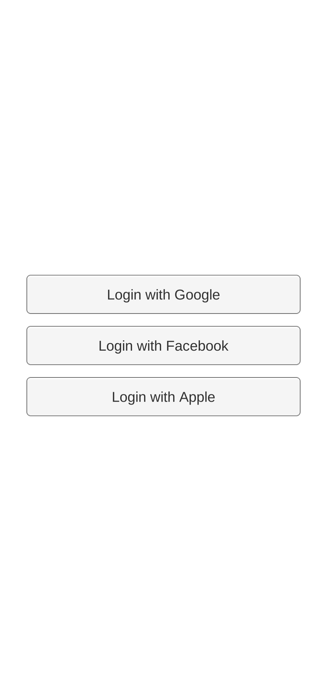
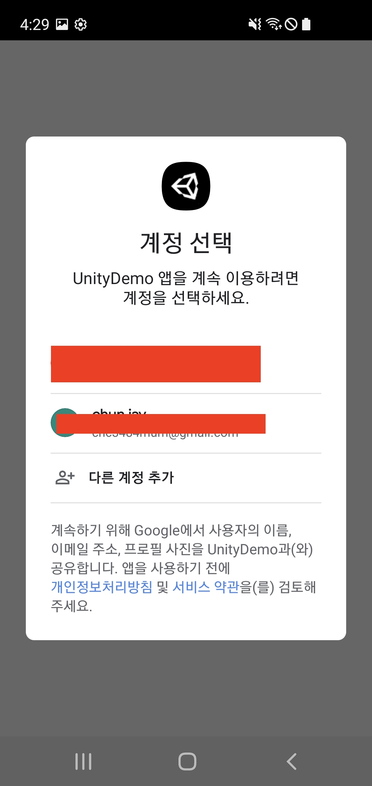
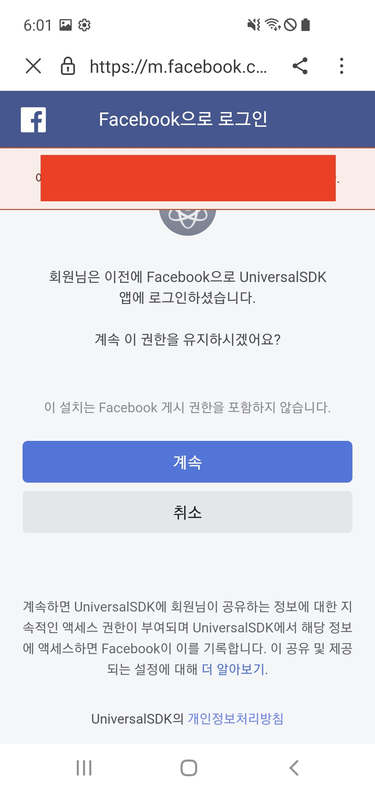
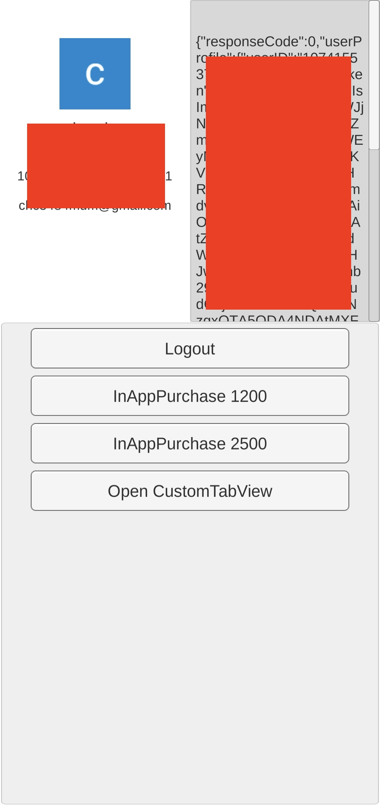
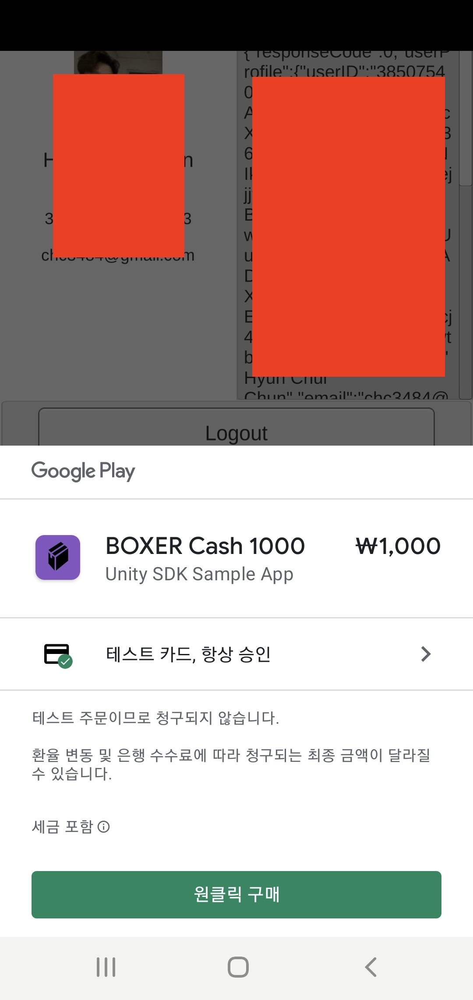

## Build Setting

> ###### Move the Plugins Folder from `Assets/UniversalSDK/Plugins` to `Assets/Plugins`.


> ###### baseProjectTemplate.gradle :

```groovy
allprojects {
    buildscript {
        ...
        }

        dependencies {            
            classpath 'com.android.tools.build:gradle:4.0.1'
            classpath "org.jetbrains.kotlin:kotlin-gradle-plugin:1.3.11"
            classpath 'com.google.gms:google-services:4.3.0'
            **BUILD_SCRIPT_DEPS**
        }
    }
}
```

## Screenshots

  
 

## Google InApp Billing TEST

If the message `This item cannot be requested` appears during the in-app purchase test, you must install the tester version released as a test track through the test participation method.

Because the apk built and distributed directly by the developer is not signed through the Google Play Console, test payment may not be smooth.

## Google Login Certificate Thumbprint Settings

If the error code `10` appears when trying to Google Login, you need to check whether the certificate fingerprint is registered in the firebase console.

Register the SHA-1 certificate thumbprint of each app signing key certificate and upload key certificate in Google Play Console App Settings > App Integrity tab in Firebase Console > Project settings > General tab.


To enable Google login for both the version released on the Google Play Console and the version directly distributed by the developer with the same certificate, you must register both the upload key certificate and the app signing certificate fingerprint.
